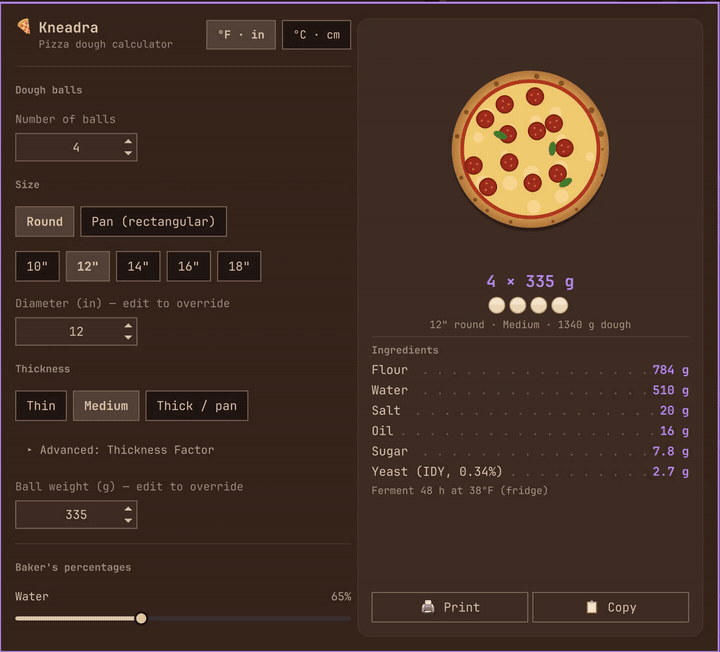
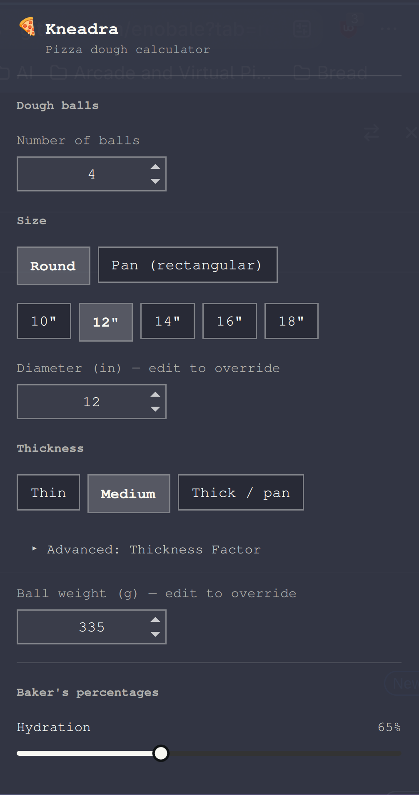

# Kneadra



**Plan pizza dough right from your Omarchy bar.** Tell Kneadra how many
pizzas, what size and crust, and how long the dough will ferment, and it
gives you the exact grams of flour, water, salt, oil, and yeast on a live
recipe card.

- 🍕 **See what you're making.** The card draws your pizza to scale: it grows
  with the diameter, turns into a pan pie in pan mode, and its crust puffs
  up from thin to thick.
- ⏱️ **Yeast that matches your schedule.** Same-day, overnight on the
  counter, or 2–3 days in the fridge: the yeast amount comes from a real
  fermentation chart (35–80°F), not a one-size rule of thumb, so long
  room-temperature ferments don't come out overproofed.
- 🧊 **Cold, then warm.** Two-stage ferments (say 48 h in the fridge, then
  3 h on the counter) get one yeast amount that accounts for both.
- 📅 **Plan by bake time.** Say when the pizza goes in the oven and Kneadra
  works back to when to mix, when to take the dough out of the fridge, and
  when to preheat, and can set an Omarchy reminder for each step.
- 🥄 **Grams and teaspoons.** Yeast shows the exact grams plus the nearest
  measuring-spoon amount (≈ 3/8 tsp), for when the scale isn't handy.
- 🎚️ **Change anything, see the grams change.** Settings on the left, recipe
  on the right, updating as you drag.
- 🖨️ **Take it to the kitchen.** Print it (or save as PDF), or copy it as
  text.
- 🌍 **°F and inches, or °C and centimetres.** One click in the header
  switches every size, temperature, and label.
- 💾 **Remembers your recipe.** Your settings are still there after a
  restart or reboot.
- Round pies or rectangular pans (Detroit, Sicilian, grandma), any ball
  count, and instant, active dry, or fresh yeast.

Click the 🍕 icon in the bar to open it.

## How it works




Set the number of dough balls and choose round (with a diameter override)
or a rectangular pan (width × length), plus a crust Thickness Factor —
Thin/Medium/Thick presets, or an advanced raw oz/in² override for anyone
who already knows their number — to get a suggested per-ball dough weight
(always editable by hand). Baker's percentages — water (hydration), salt, oil,
sugar, and optional diastatic malt (0% by default; for extra browning in a
home oven) — are set with sliders. Pick a fermentation temperature (°F) and
target time, and the yeast percentage is read from a fermentation chart
(hours to full proof by temperature and yeast dose, 35–80°F) and
interpolated between its cells; shorter or warmer ferments need more yeast,
long ferments — including 24h+ at room temperature — need very little. If
the time or temperature falls outside what the chart covers, a note under
the yeast row says so. Yeast type (instant dry / active dry / fresh)
converts the final gram amount; dry yeast also shows a teaspoon measure
(about 3.1 g per teaspoon — a 7 g packet is 2¼ tsp).

Choose **Cold, then warm** for a two-stage ferment. Each stage gets its own
temperature and time, and the yeast is the dose at which the stages together
add up to one full proof (each stage contributes its hours ÷ the chart's
hours-to-full-proof at that temperature).

Turn on **Plan by bake time** and pick a bake day and time (type into the
fields too: "sat", "6:30 pm", "18:30"). The card lists when to mix, when to
move the dough between stages, when to preheat (an hour ahead), and when to
bake. A bake time too soon for the ferment moves to the earliest one that
works (mix now), and if a saved plan's mix time has passed, **Mix now**
restarts it from this moment. **Remind** sets a desktop reminder for each upcoming step through
`omarchy-reminder`. Those reminders are systemd user timers, so a reboot or
logout clears them.

The recipe card shows the resulting flour, water, salt, oil, sugar,
diastatic malt (when used), and yeast weights in grams for the total batch.

Settings are saved to `~/.local/state/omarchy/io.github.enobale.kneadra.json`
(delete it to start over from the defaults).

## Install

```bash
omarchy plugin add https://github.com/enobale/omarchy-kneadra --enable
```

Or, to keep a local editable copy instead of a git checkout:

```bash
git clone https://github.com/enobale/omarchy-kneadra ~/.config/omarchy/plugins/io.github.enobale.kneadra
omarchy plugin enable io.github.enobale.kneadra
```

## Keybinding

Kneadra exposes an IPC target, so you can open it from the keyboard. Add to
`~/.config/hypr/bindings.conf`:

```
bind = SUPER ALT, P, exec, qs -p /usr/share/omarchy/shell ipc call io.github.enobale.kneadra toggle
```

## Remove

```bash
omarchy plugin remove io.github.enobale.kneadra
```

## Files

- `manifest.json` — plugin manifest (`kinds: ["bar-widget"]`)
- `BarWidget.qml` — bar icon + popup UI, built on Omarchy's `Panel` /
  `KeyboardPanel` / `WidgetButton` / `PanelSlider` / `NumberField` /
  `ButtonGroup` / `Toggle` components (no external dependencies beyond
  the Omarchy shell's own `qs.Ui` / `qs.Commons` component kit)
- `PizzaPreview.qml` — the to-scale pizza + dough-ball illustration on the
  recipe card (a QML `Canvas`)
- `Calculator.js` — pure dough-math helpers (dough-weight suggestion from
  pan area and Thickness Factor, temperature/time-based yeast percent,
  baker's-percentage solve, two-stage fermentation, teaspoon conversion,
  bake schedule)

## License

MIT — see [LICENSE](LICENSE).
